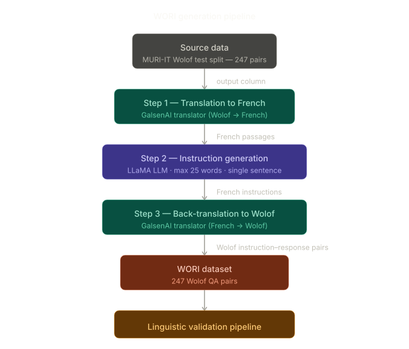

# WORI: Building a Wolof Instruction-Response Dataset through Reverse Instruction

**Marème Diop** | AI & Big Data Engineering | March 2026

---

## Project Summary

Wolof is a low-resource language for which instruction-tuning datasets, the type of data needed to train and evaluate modern language models on question-answering tasks, essentially do not exist. This project is a direct response to that gap. It introduces **WORI** (Wolof Reverse Instruction), a pipeline for generating Wolof question-answering datasets from existing multilingual data, and evaluates its linguistic quality through a rigorous validation methodology.

The project was conducted in three successive studies. The first established which language identification tool performs best on Wolof, through a comparative benchmark of fastText, GlotLID, and AfroLID. The second applied this knowledge to audit the linguistic quality of an existing multilingual dataset that nominally includes Wolof, providing both empirical grounding and a validation baseline. The third built the WORI pipeline itself and measured its output against that baseline.

---

## Context and Motivation

Instruction-response datasets are critical for training and evaluating language models, yet for Wolof none existed at a usable scale. Existing multilingual datasets that nominally include Wolof had not been independently verified for linguistic quality, which is an important gap given the well-documented risk of label noise in automatically generated low-resource data.

Before building WORI, two preliminary studies were conducted to establish the methodological foundations of the project.

**Language identification benchmark.** Evaluating the linguistic quality of any Wolof dataset requires a reliable language detector. A comparative benchmark was conducted across fastText LID-176 (Joulin et al., 2017), GlotLID (Kargaran et al., 2023), and AfroLID (Adebara et al., 2022), using a silver evaluation set constructed through manual linguistic validation. FastText fails on realistic Wolof text due to insufficient training coverage. GlotLID is overly conservative and misses a significant proportion of valid Wolof instances. AfroLID provides the best trade-off between precision and recall and was selected as the primary detector for all subsequent analyses.  
Full benchmark: [wolof-language-detection-eval](https://github.com/MaDi-12/wolof-language-detection-eval)

**Linguistic audit of MURI-IT.** MURI-IT (Koksal et al., 2024) is a large-scale multilingual instruction dataset that includes a Wolof-labeled subset of 4,457 examples, generated through a reverse instruction mechanism. A systematic linguistic audit of this subset was conducted using the validation pipeline described below, estimating the actual Wolof proportion at 28.76%, well below what the label implies. The primary cause is structural: the MURI-IT generation pipeline embeds source-language framing text directly into instructions, producing constructions such as *"A text in Ganda: [...] Here is a translation to Wolof:"*, in which the instruction itself is predominantly non-Wolof.  
Full audit: [linguistic-validation-low-resource-datasets](https://github.com/MaDi-12/linguistic-validation-low-resource-datasets)

These two studies directly informed the design of WORI. The benchmark determined which tools to use for validation. The audit identified the specific contamination pattern that WORI's architecture is designed to avoid. MURI-IT also provided the source data for WORI: its 247-example test split was used as input, enabling a direct comparison between both pipelines under identical conditions.

---

## The WORI Generation Pipeline

The WORI pipeline produces Wolof instruction-response pairs from existing multilingual data in four steps.

**Source data.** The MURI-IT Wolof test split (247 examples) is used as the starting point. Using the same examples as MURI-IT enables direct structural comparison between both pipelines.

**Step 1: Translation to French.** The response column of each example is translated from Wolof into French using GalsenAI, a translation model specifically developed for Wolof-French.

**Step 2: Instruction generation.** A Llama-based LLM generates a natural language instruction for each French passage. Generation is constrained to a single sentence of at most 25 words. This constraint was introduced after preliminary experiments showed that unconstrained generation produced instructions with structural noise and stylistic inconsistencies.

**Step 3: Back-translation to Wolof.** The French instructions are translated back into Wolof via GalsenAI, yielding the final Wolof instruction-response pairs.

The key architectural distinction from MURI-IT is the separation between generation and translation. By generating instructions in French first and translating them independently, no source-language framing text enters the Wolof instruction field. Note that this pipeline is designed around tools specifically available for Wolof, GalsenAI in particular, and is not directly transferable to other languages without equivalent translation infrastructure.

---

## Linguistic Validation Methodology

A hierarchical pipeline was applied to evaluate the linguistic quality of both WORI and MURI-IT under identical conditions.

**Step 1: fastText (global multilingual detection).** All 247 instructions are processed by fastText LID-176. A confidence threshold τ = 0.7 separates high-confidence predictions (classified as non-Wolof and excluded) from ambiguous cases. This step is necessary to prevent AfroLID from being applied to English or French text, which it does not cover and would misclassify as the closest African language.

**Step 2: AfroLID (African language detection).** AfroLID 1.5 is applied to the ambiguous cases to detect the presence of a Wolof signal within the African language space.

**Step 3: Triangulation.** The global Wolof proportion is estimated by combining both steps. A secondary metric, *strong Wolof*, is defined as instances where AfroLID confidence is at or above 0.5.

---

## Results

WORI achieves a global estimated Wolof proportion of **98.79%**, compared to **32.39%** for MURI-IT, a threefold improvement. In WORI, fastText is unable to confidently classify 99.19% of instructions, reflecting the expected behavior of genuine Wolof text in a model with no Wolof training coverage. AfroLID subsequently detects Wolof in 99.59% of those ambiguous cases with near-perfect confidence (mean = 0.991, median = 0.997).

In MURI-IT, fastText assigns high-confidence non-Wolof labels to 37.65% of instructions, predominantly English and French, before AfroLID is even applied. Of the remaining ambiguous cases, AfroLID detects Wolof in only 51.95%, confirming the structural contamination identified in the audit.

| Indicator | WORI | MURI-IT |
|-----------|------|---------|
| Total examples | 247 | 247 |
| fastText: Wolof detected | 0 (0.00%) | 0 (0.00%) |
| High-confidence non-Wolof (>= τ) | 2 (0.81%) | 93 (37.65%) |
| Ambiguous cases sent to AfroLID | 245 (99.19%) | 154 (62.35%) |
| AfroLID: Wolof in ambiguous | 244 / 245 (99.59%) | 80 / 154 (51.95%) |
| AfroLID mean confidence | 0.991 | 0.887 |
| Strong Wolof (conf. >= 0.5) | ~244 | 69 |
| **Global estimated Wolof rate** | **98.79%** | **32.39%** |

**fastText language distribution — WORI**

**AfroLID language distribution — WORI**

**fastText language distribution — MURI-IT**

**AfroLID language distribution — MURI-IT**

---

## Limitations

The dataset has not been validated by human annotators. AfroLID confirms Wolof presence at the language identification level but cannot assess grammatical correctness, semantic coherence, or naturalness of the generated instructions. Finally, 247 examples is sufficient for validation purposes but modest for downstream model training.

---

## Perspectives

Several directions are identified for future development. Prompt diversification, varying instruction types such as factual, summarization, and reasoning tasks, would increase dataset diversity. Coupling the pipeline with automatic quality metrics such as translation quality scores or semantic similarity would strengthen the validation framework without requiring full human annotation. Scaling the pipeline to larger Wolof corpora beyond the MURI-IT test split remains the primary requirement for producing a training-scale dataset.

---

## References

Adebara, I., Elmadany, A., Abdul-Mageed, M., & Inciarte, A. (2022). AfroLID: A neural language identification tool for African languages. *Proceedings of EMNLP 2022*.

[Diop, M. (2026). Linguistic audit of the MURI-IT Wolof subset.](https://github.com/MaDi-12/linguistic-validation-low-resource-datasets)

[Diop, M. (2026). Wolof language detection evaluation — Silver benchmark.](https://github.com/MaDi-12/wolof-language-detection-eval)

Joulin, A., Grave, E., Bojanowski, P., & Mikolov, T. (2017). Bag of tricks for efficient text classification. *Proceedings of EACL 2017*.

Kargaran, A. H., Imani, A., Faili, H., & Schütze, H. (2023). GlotLID: Language identification for low-resource languages. *Proceedings of EMNLP 2023*.

Koksal, A., Üstün, A., Mirza, A., Chau, G., Aji, A. F., & Schölkopf, B. (2024). MURI-IT: A massive multilingual instruction dataset. *arXiv preprint arXiv:2409.12958*.
